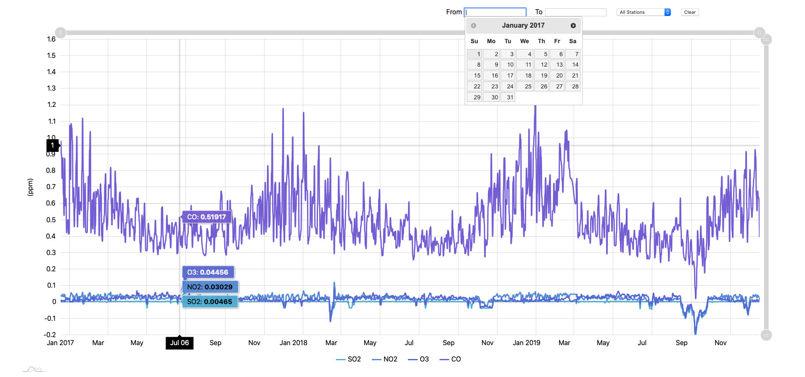

## Air Pollution in Seoul
### Problem Statment
We need to visualize air pollution levels in Seoul for 3 consecutive years (2017-2019). We do this by tracking the average ppm levels for S02, NO2, O3, and CO on a per day basis over 3 years.  

The dataset used for this project is available at [Kaggle](https://www.kaggle.com/bappekim/air-pollution-in-seoul/data#Measurement_summary.csv​)

### Preview



### Project Requirement
- Using [Papaparse](https://www.papaparse.com/), we need to parse
 the file from kaggle  and render a page that contains a line chart using [AMCharts 4](https://www.amcharts.com/docs/v4/) that shows S02, NO2, O3, and CO levels as line charts over time. 
     - ​Y Axis should represent the date of measure​
     - ​X Axis is the ppm amount​.
     - Each item name of emission should be represented as a single line in the line chart. 

- On top of the chart, we should have a​ dropdown selector to show stationwise pollution levels
- A date range picker to select the date range of data to render​
    - The data range picker can work in complement to the select box or both can work individually

- The page should intelligently render charts to fit the data based on the selected options.


### Software Requirements

A Typescript based NodeJS server is created with the following utilties:

- Used [Papaparse](https://www.papaparse.com/) to parse CSV files
- Used [AMCharts 4](https://www.amcharts.com/docs/v4/) to render line (XY)  chart
- Used [lodash](https://lodash.com) utility for data aggregation and data manipulation . Functions used [groupBy](https://lodash.com/docs/4.17.15#groupBy) (filter and aggregate data per station), [pick](https://lodash.com/docs/4.17.15#pick), map, filter, reduce, etc
- Used [Media Queries](https://developer.mozilla.org/en-US/docs/Web/CSS/Media_Queries/Using_media_queries) to make page mobile responsive
- Use [jQuery UI datepicker](https://jqueryui.com/datepicker/) along with client side validations

---
### Setup

After cloning the repository, run commands in the follwing order in the project directory:
```
yarn install
```
and then 
```
yarn start
```

Once the server starts, open [http://localhost:3000/](http://localhost:3000/) in your browser

https: (WIP) ~~Open in Firefox and choose Accept Risk and continue~~ 

### Testing
All the fields are dynamic. 
Choose either fill "From & To Date" with "Select box" to filter data or use them individually 
